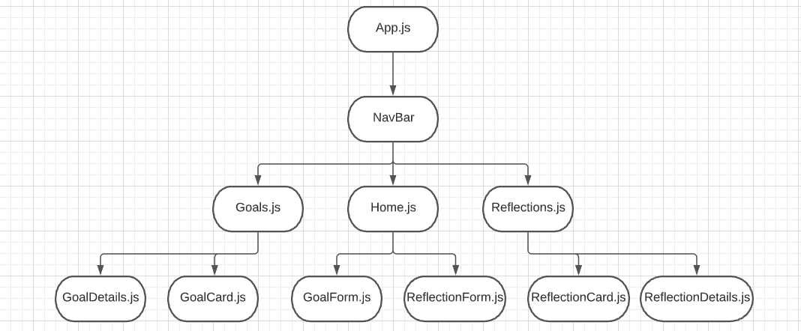
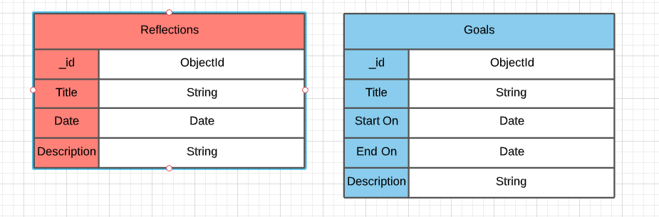

# Balance

## Date: 8/29/2021

### By: Jin Im Brancalhao

[GitHub](https://github.com/jinimbrancalhao) | [LinkedIn](https://www.linkedin.com/in/jin-im-826a6b215/) | [Instagram](https://www.instagram.com/jinnybphoto/)

---

**_Description_**

This app is a digital diary of sorts. Its purpose is to provide an easy way to reflect and set goals. One can add new goals and reflections, as well as browse through past goals and reflections. Diaries are usually structered with just an open space for people to write down their thoughts. The idea of this app is to serve the particular focus of reflecting on past experiences, and setting new goals to be happier and more succesful.

**_Technologies Used_**

- Mongoose
- Express
- React
- Node
- Heroku

**_Getting Started_**

[Trello](https://trello.com/b/TXOgdIr6/balance)

[Diagrams](https://lucid.app/lucidchart/28e5f9a4-7e7f-43cb-b1f8-a738ba6b39da/edit?beaconFlowId=D9C4A8D2E07F1147&page=0_0#)

**_Screenshots_**

#### Component Hierarchy Diagram

#### Entity Relationship Diagram

**_Future Updates_**

**_Credits_**
