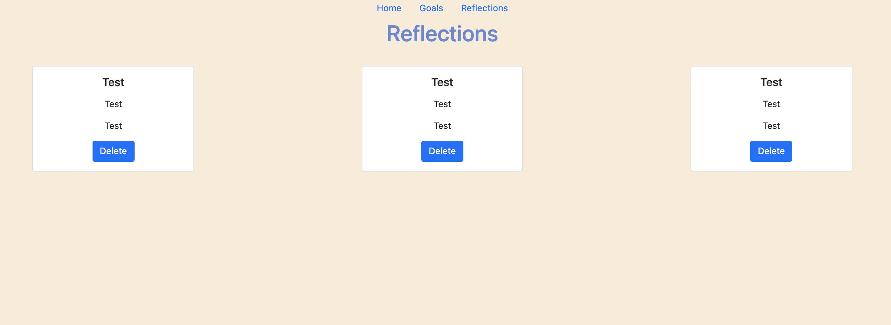

# Balance

## Date: 8/29/2021

### By: Jin Im Brancalhao

[GitHub](https://github.com/jinimbrancalhao) | [LinkedIn](https://www.linkedin.com/in/jin-im-826a6b215/) | [Instagram](https://www.instagram.com/jinnybphoto/)

---

**_Description_**

This app is a place in which people can write reflections and goals, as well as view reflections and goals other people have written. The idea behind this app is people can share their stories and what they have learned from them. In addition, they can learn and be inspired by others.

**_Technologies Used_**

- MongoDB
- Express
- React
- Node
- Heroku

**_Getting Started_**

[Trello](https://trello.com/b/TXOgdIr6/balance)

[Diagrams](https://lucid.app/lucidchart/28e5f9a4-7e7f-43cb-b1f8-a738ba6b39da/edit?beaconFlowId=D9C4A8D2E07F1147&page=0_0#)

[Heroku Link](https://radiant-depths-30152.herokuapp.com/goals)

**_Screenshots_**

#### Component Hierarchy Diagram

#### Entity Relationship Diagram

#### Home

#### Goals

#### Reflections

**_Future Updates_**

- One future update I wish to make is I want there to be accounts. People can make their posts either private or anonymous. What this would allow for is this app to be a private tool for people to reflect and set goals as well as a social app for people to connect and hear the stories of others.
- I would love for the styling to be better. I would like for there to be more dynamic aspects. For example, giving the user more than just text boxes to write. Things like emojis could add to the user experience.

**_Credits_**
